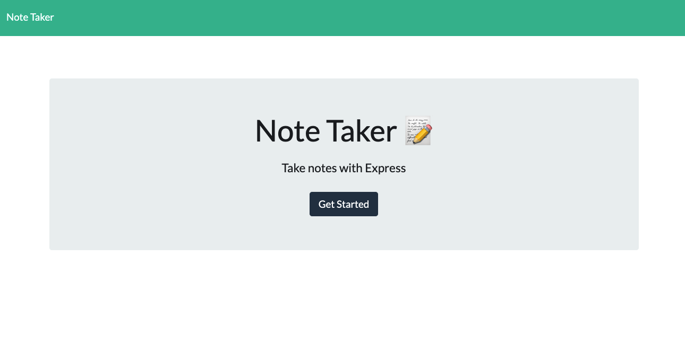
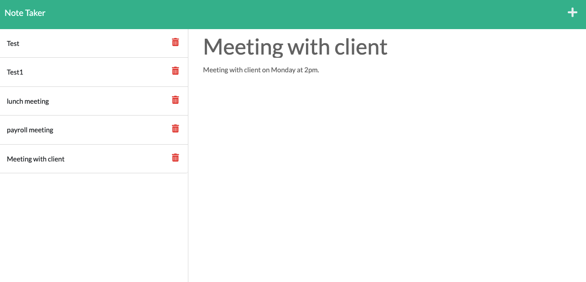
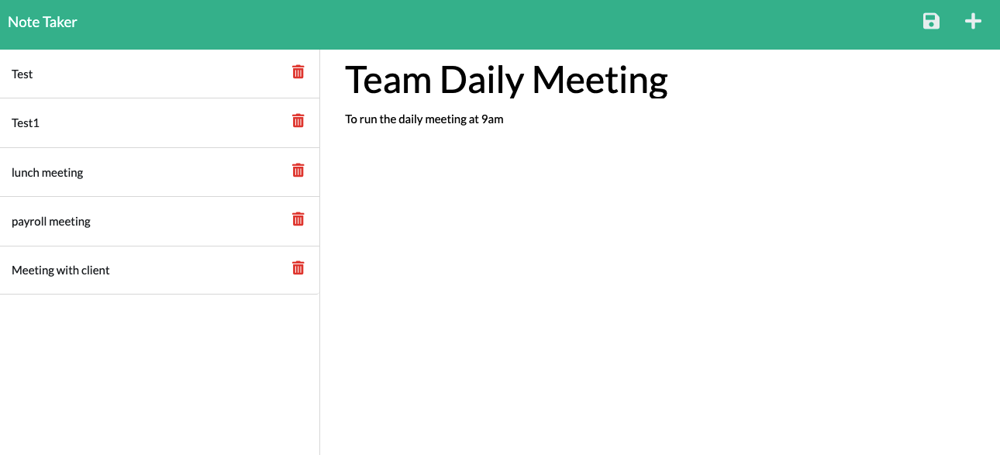
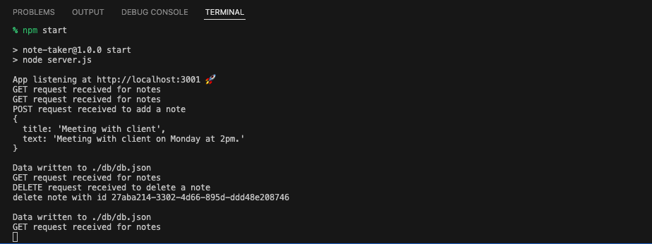

# Note Taker - Express.js Project


## Description

The Note Taker is a simiple application that can be used to write and save notes. In this application, user can add and save new notes, review the existing notes, and delete any saved note as needed. All saved notes will be displayed again when user reopens the application page.

## Table of Contents

- [Description](#description)
- [Installation](#installation)
- [Usage](#usage)
- [Technology](#technology)
- [Credits](#credits)
- [Assets](#assets)
- [Link](#link)
- [License](#license)

## Installation

For user - no installation needed, please visit the deployed link directly

For contributor - please run the command `npm i` before starting the application

## Usage

Here is a simple usage instruction for the Note Taker application:
- User will start with a landing page with a link to a notes page
    - Click on the "Get Started" button to go to the notes page
- In the notes page, user will see the saved notes listed in the left-hand column, and empty fields to enter the note title and note text in the right-hand column
- After entering a note title and note text, a save icon will be triggered in the upper right corner of the page
    - Click on the save icon to save your note
    - The newly saved note will be shown in the left-hand column with other existing notes
- User can also click on other existing notes in the left-hand column to review notes that have been saved before
- To add more notes, please click on the "+" icon in the upper right corner of the page
    - Empty fields for note title and note text will be shown again
    - Click on the save icon to save your note
- Click on the trash can icon to delete any existing note as needed


## Technology
```md
JavaScript
Express.js
HTML (provided with the starter code)
CSS (provided with the starter code)
```


## Credits

- The Note Taker application is functioning with [Express.js](https://expressjs.com/) and [npm uuid](https://www.npmjs.com/package/uuid)

- The starter code is provided by The Coding Boot Camp | UC San Diego Extension | Trilogy Education Services, LLC

## Assets

The following images demonstrate the Note Taker application's functionality:

The landing page:



The Note Taker:





In terminal:



## Link

**Please click [here](https://note-taker-express-js-123.herokuapp.com/) to find the deployed application in Heroku**

## License

Copyright (c) 2022 Elaine D. This project is licensed under the terms of the MIT license.